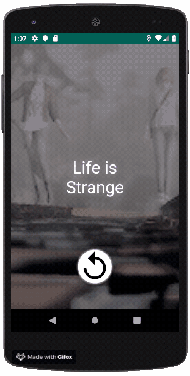

# T4R

## What is T4R?

Things for R (T4R) is a side project for learning how to program Mobile Apps through React-Native and React-Redux, while enjoying the Little Things. In an early version, T4R has been completely developed in Kotlin, native Android while following a MVP pattern.  

**[Now available for Beta Testing on Google Play!](https://play.google.com/store/apps/details?id=com.awesome.llovagn.t4r)**

### What are Things?

There is no better way to describe what Things are than to show them:

In T4R, Things can be any combination of:

* Texts
* Colors
* Images
* GIFs
* Sounds

### Next Steps

* Migration to React-Redux.
* Using network for downloading images.
